# Spatiotemporal Analysis with MapReduce

# Deliverables

The project specification defines several questions that you will answer with MapReduce jobs. You should edit this document (README.md) with your answers as you find them, including figures, references, etc. This will also serve as a way of tracking your progress through the milestones.

## Deliverable I

#Total records - rushabh 1051168

________________________________________________________

#Record Count    323759744

________________________________________________________

#Snowdepth(30%)

c1gyqex11wpb	0.51488906

c1p5fmbjmkrz	0.85555834

c41xurr50ypb	1.442782

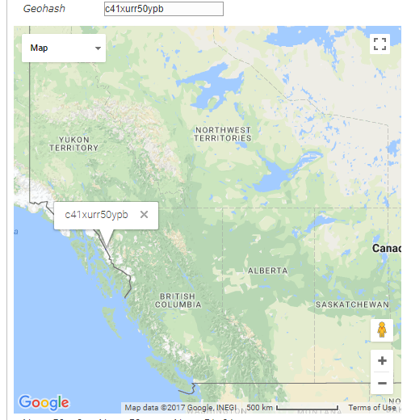

________________________________________________________

#Hottest temp

GeoHash         Time                                        Temperature

d5dpds10m55b 1440266400000 (Sat 22 August 2015 11:00:00)    331.39062

d5f0jqerq27b 1440698400000 (Thu 27 August 2015 11:00:00)    331.0957

d5f0fgg1kg5b 1438279200000 (Thu 30 July 2015 11:00:00)      330.05493

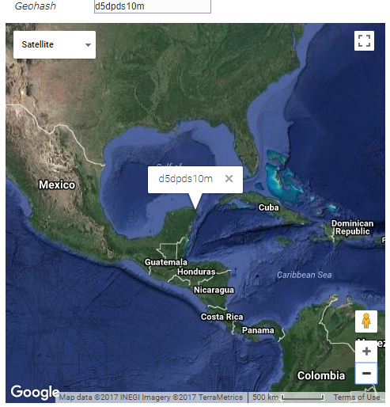

________________________________________________________

#Lightning

9g0g    2280.0

9g3m    2271.0

9err    2237.0

9g3y    2117.0

9g3u    2072.0

9ery    2072.0

9eqe    2003.0

9erx    1950.0

9g3j    1847.0

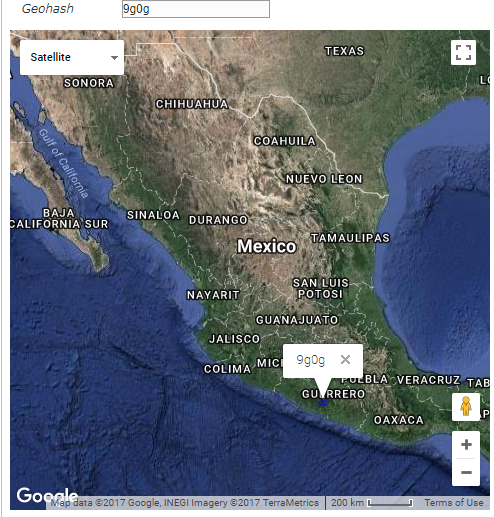

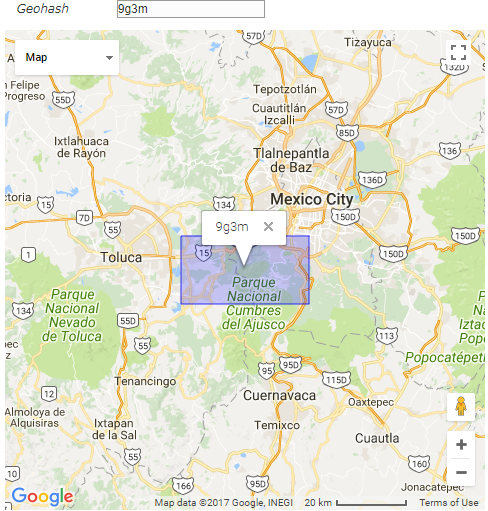

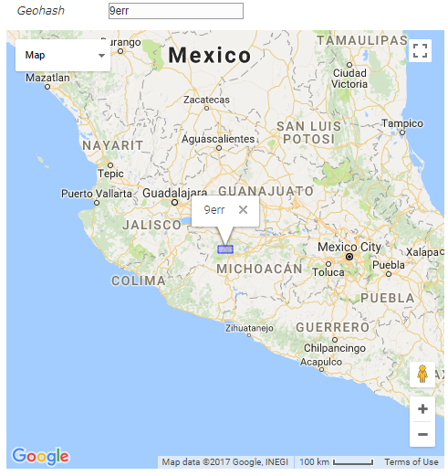

________________________________________________________

#Driest Month(30%)

(March) 2	22.484657

        5	23.899132

        7	23.986382

        0	27.331087

        1	28.216106

        4	29.038776

        9	29.851631

        3	34.509075

        6	35.964863

        8	35.995064

        10	41.317936

        11	44.500378

Driest month is March.

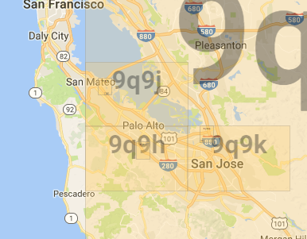

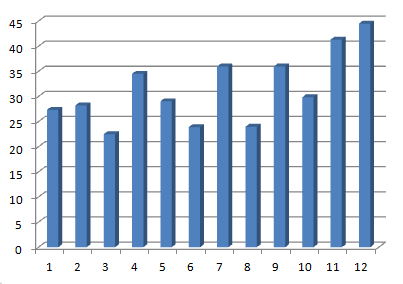

________________________________________________________

#Travel Locations

For Travel plan I am looking for the temperature, I will visit the place only when the temperature is between 300-310.

----------------------------------

Month-Geohash   Temperature

//Las Vegas

1 - 9qjj        300.81155

2 - 9qjj        303.1361

3 - 9qjj        304.00043

4 - 9qjj        305.125

5 - 9qjj        306.58725

6 - 9qjj        305.30783

7 - 9qjj        304.8997

8 - 9qjj        305.6239

9 - 9qjj        303.88287

10 - 9qjj       301.65475

//Yosemite

3 - 9qdy        300.4895

4 - 9qdy        303.3832

5 - 9qdy        304.93423

6 - 9qdy        303.95865

7 - 9qdy        304.19412

8 - 9qdy        302.8843

9 - 9qdy        301.22028

//Long Beach

2 - 9q5b        301.00815

3 - 9q5b        301.74213

4 - 9q5b        301.22357

5 - 9q5b        302.13165

6 - 9q5b        302.1716

7 - 9q5b        302.7103

8 - 9q5b        303.1703

9 - 9q5b        302.34467

//San Diego

9 - 9mud        301.334

8 - 9mud        301.91602

7 - 9mud        301.51962

6 - 9mud        301.07642

5 - 9mud        301.48615

4 - 9mud        300.14413

3 - 9mud        301.03625

2 - 9mud        300.35904

From the data above I might visit the above place in May,June or July after my graduation. I also want to visit Santa Cruz and Honolulu but temperature here never gets 300-310 Kelvin so I would not visit these places.

________________________________________________________

#Climate Chart

<-month-num->  <-high-temp->	<-low-temp->  	<-avg-precip-> <-avg-temp->

0		275.5874	243.26978	7.1896834	266.24643

1		277.13223	252.10886	7.1380935	268.4484

10		281.95288	251.90723	6.006919	267.855

11		274.70435	250.45914	5.754779	265.45825

2		289.9591	251.15161	8.086083	274.6237

3		297.4214	266.57413	7.3920016	277.87326

4		298.88965	268.15314	9.971195	283.22507

5		304.1787	274.2793	17.462223	288.55908

6		305.04468	273.51294	18.381325	289.79636

7		307.99146	269.7185	17.44149	288.99945

8		302.3418	267.9358	13.376794	283.0552

9		294.365		264.51538	10.626245	278.97723

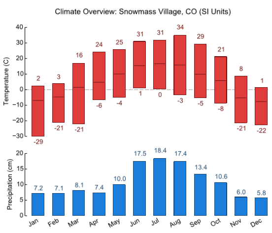

________________________________________________________

#Solar wind farm

Wind

<-Geo->           <-Wind->                  <-Cloud Cover->           <-Wind+Cloud Cover->

dnm7pjed9tup    105.88756771651175      0.4                     106.28756771651176

dr7h8xsrfpkp    100.42182395834658      0.6666666666666666      101.08849062501325

c8t7jce5d080    97.02563211415182       2.0                     99.02563211415182

9yyxksdcbxrz    96.553557374607         0.4                     96.953557374607

c8t3fgvvs9bp    94.80384408719705       0.4                     95.20384408719706

9vtv0wvhvuu0    94.461953768104         0.6666666666666666      95.12862043477067

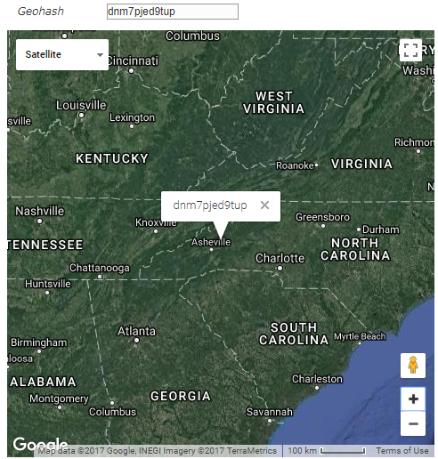

________________________________________________________

solar

<-Geo->           <-Wind->                  <-Cloud Cover->           <-Wind+Cloud Cover->

dn94j9cnmukp    22.67113014335555       0.15384615384615385     22.824976297201705

9qc667bx7zeb    11.592039543713963      0.16666666666666666     11.758706210380629

cbfzp12zk5eb    7.013997969390048       0.16666666666666666     7.180664636056715

dn58kwum1z7z    16.310824380018225      0.16666666666666666     16.477491046684893

dp4gp265c6bp    11.855000372492908      0.16666666666666666     12.021667039159574

9twxz5j9tcup    11.12672240331998       0.18181818181818182     11.30854058513816

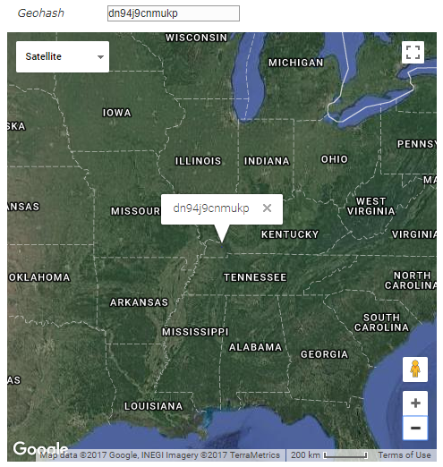

________________________________________________________

Wind + Solar

<-Geo->           <-Wind->                  <-Cloud Cover->           <-Wind+Cloud Cover->

dnm7pjed9tup      105.88756771651175      0.4                     106.28756771651176  

9yyxksdcbxrz      96.553557374607         0.4                     96.953557374607

9yu8q0fkmw5b      93.10403602559852       0.3333333333333333      93.43736935893185
    
9tdkye2p5e0p      88.42923505280649       0.25                    88.67923505280649

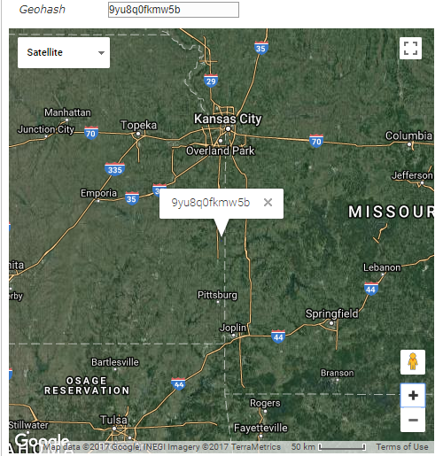
